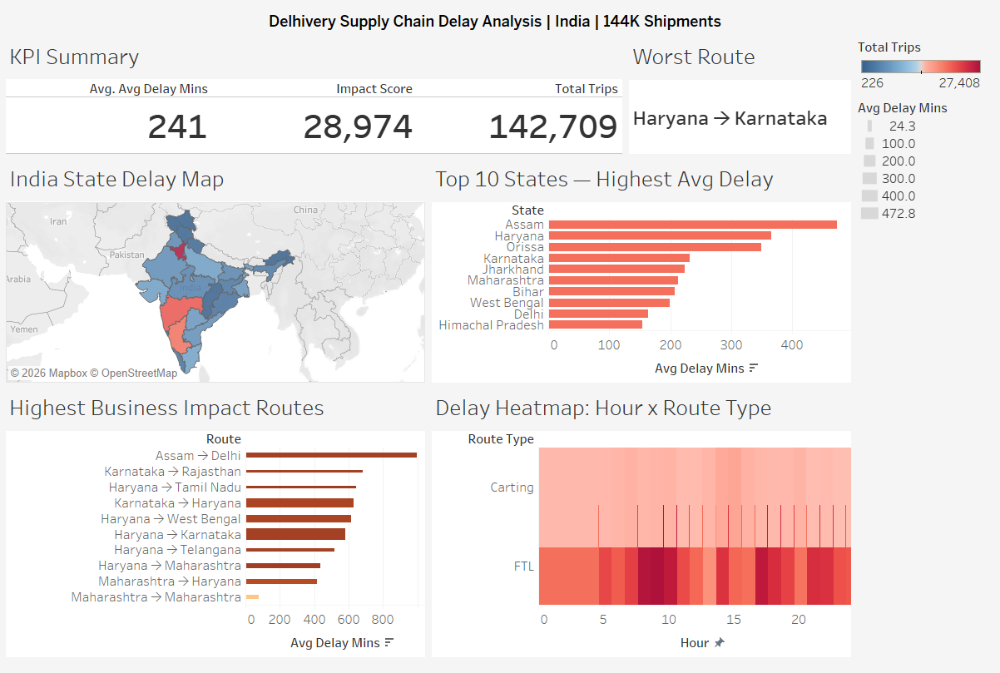
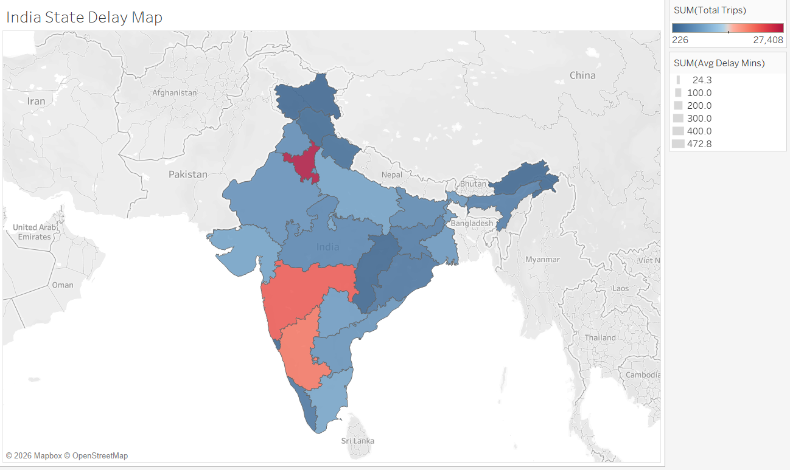
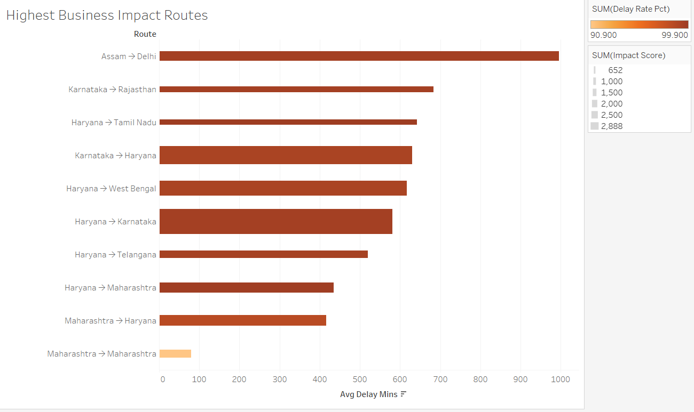
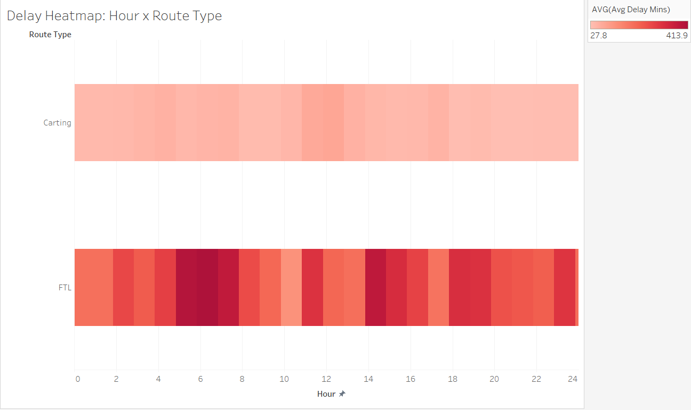

# 🚚 Delhivery Supply Chain Delay Analyzer



## 📌 Project Overview
An end-to-end supply chain analytics project analyzing **144,316 real shipments** 
from Delhivery — One of India's largest logistics company. The goal was to identify delay 
patterns by route, state, transport mode, and time of day to surface actionable 
operational insights.

---

## 🔑 Key Findings

| Metric | Value |
|--------|-------|
| Total Shipments Analyzed | 144,316 |
| Overall Delay Rate | 88% |
| Average Delay | 203 minutes (3.4 hours) |
| Worst Route | Assam → Delhi (995 min avg delay) |
| Highest Impact Route | Haryana → Karnataka (4,976 trips) |
| FTL Delay Rate | 94.3% |
| Carting Delay Rate | 74.2% |
| Worst Source State | Assam (473 min avg delay) |
| Worst Destination State | Delhi (372 min avg delay) |

---

## 💡 Business Insights

1. **FTL is underperforming Carting** — Despite being the premium route type,
   FTL has a 94.3% delay rate vs 74.2% for Carting. Suggests FTL route 
   planning needs urgent review.

2. **North-South corridors are critical bottlenecks** — Routes like 
   Haryana → Karnataka and Assam → Delhi consistently show 10-16 hour delays,
   pointing to hub inefficiencies on long-distance routes.

3. **Assam is a structural problem, not a seasonal one** — With 473 min avg 
   delay as a source state, Assam's issues persist regardless of season,
   suggesting infrastructure or partner capacity constraints.

4. **Early morning dispatches (5-6 AM) have the highest delays** — Trips 
   created between 5-6 AM average 340 min delay, likely due to overnight 
   backlogs hitting the network simultaneously.

5. **Delays are NOT seasonal** — Peak season (Oct-Dec) adds only ~12 min 
   over normal season, meaning this is a year-round operational issue,
   not a festive demand spike problem.

---

## 🛠️ Tools & Technologies

| Tool | Purpose |
|------|---------|
| Python (Pandas, NumPy) | Data cleaning & feature engineering |
| Matplotlib & Seaborn | Exploratory data analysis charts |
| SQLite + SQL | Business queries & aggregations |
| Tableau | Interactive dashboard |
| Jupyter Notebook | Analysis environment |
| Git & GitHub | Version control |

---

## 📁 Project Structure

```
Revenue-Optimization-Engine/
│
├── data/
│   ├── raw/                    # Original Delhivery dataset
│   ├── cleaned/                # Cleaned dataset (36 features)
│   └── Tableau_ready/          # Pre-aggregated CSVs for Tableau
│
├── python/
│   └── delhivery_supply_chain_analysis.ipynb
│
├── Tableau/
│   ├── Dehlivery_Dashboard.twb
│   └── Visuals/                # Dashboard screenshots
│
└── README.md
```

---

## 📊 Dashboard Preview





---

## 🗂️ Dataset

- **Source:** [Delhivery Dataset — Kaggle](https://www.kaggle.com/datasets/nayanack/delhivery)
- **Size:** 144,867 rows × 24 columns (raw)
- **Period:** September — October 2018
- **Company:** Delhivery, India's largest logistics company by revenue

---

## 🚀 How to Run

```bash
# 1. Clone the repo
git clone https://github.com/akardhansharma/Revenue-Optimization-Engine.git

# 2. Install dependencies
pip install pandas numpy matplotlib seaborn sqlalchemy jupyter

# 3. Open the notebook
jupyter notebook python/delhivery_supply_chain_analysis.ipynb
```

---

## 👤 Author 
[https://www.linkedin.com/in/akardhan/](#) • [https://github.com/akardhansharma](#)